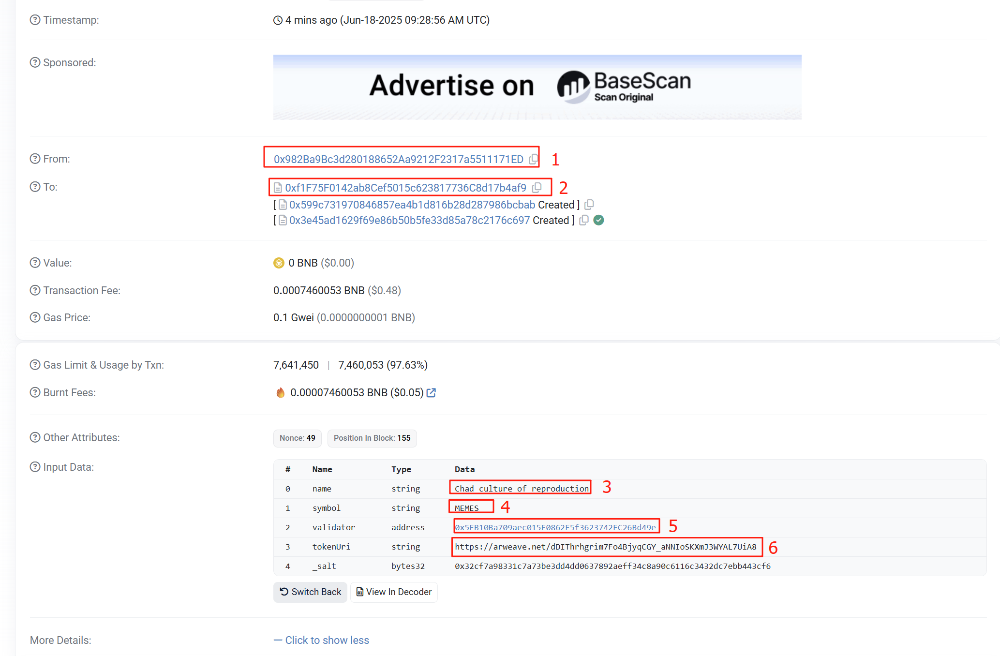

# Setup project
Create a .env file, copy content in .env.sample to .env, replace `API_KEY` to your api key on etherscan
```
npm install
```

```
npx hardhat compile
```

# Find params
1. Open token address in explorer and find the create transaction of this token


2. Open "More details" and click "Decode input data"


3. Replace variables in bab.ts

name-3
symbol-4
tokenURI-6
factoryAddrss-2
creatorAddress-1
validatorAddress-5


# Run verify
1. Uncomment main function in bab.ts according to which type of token you want to verify
2. Run `npm run bab {chainName}`, chainName can be 'sepolia', 'bsc', 'bscTest', for example: `npm run bab bsc`